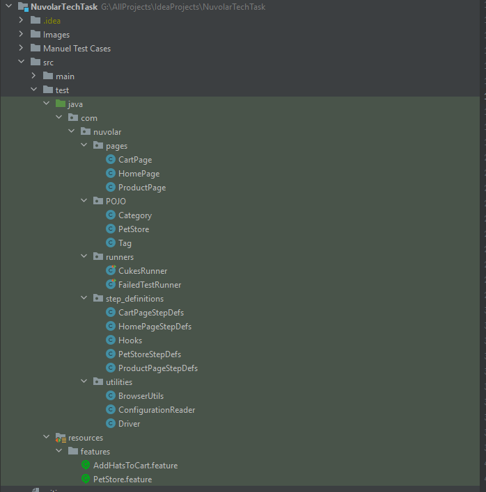
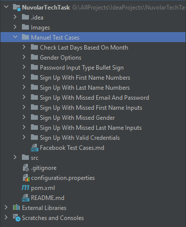

# PROJECT SUMMARY
* This project developed for Nuvolar Interview Task
* **[Java 11](https://www.oracle.com/tr/java/technologies/javase/jdk11-archive-downloads.html)** was used as developing language
* **[Maven 3.8.5](https://maven.apache.org/download.cgi)** Build managment tool
* Cucumber Framework was used
* Project support multi OS
* Project support different browsers, selenium grid and parallel testing
* For reporting was used "maven-cucumber-reporting plugin" version "5.0.0"
* Project was developed with **[Intellij IDEA](https://www.jetbrains.com/idea/download/#section=windows)**


# SUMMARY OF STRUCTURE
* Project contain 3 different Test FrontEnd, BackEnd, Manuel Test Cases
* Project was developed by using cucumber framework. Automation structure has 3 main title
  * src folder ==> contains test codes and feature files (main body of code structure)
    * src folder structure like the below
    
    
    
    * java folder contain main code structure and resource folder contain feature/scenario files
      * POM design pattern was used in JAVA folder
      * pages package ==> Page Object Model that contains definition of relevant of each different page
      * runners package ==> contains runner class for run the project
      * step definition ==> contains relevant each step codes
      * utilities ==> contains utility classes for test run 
    * resource folder ==> contains feature/execution files for scenarios which has written gherkin.
  * configuration.properties ==> contains several options like browser and URLs that using in the project;
  * pom.xml ==> contains dependencies, options, plugins that the project needs
* There is some detail tips in the relevant class for methods and classes
* Finally The manuel test cases and execution results in the "Manuel Test Cases Directory"


# TEST EXECUTION
* You must have relevant JAVA, maven, **[Google Chrome (latest version)](https://www.google.com/chrome/?brand=CHBD&gclid=Cj0KCQjwr-SSBhC9ARIsANhzu15P0PA-n9Zp4NpxKaOHVGtBD1TZQH0HlQQE6hUfsOFAU1nf-Rzdlf4aAoTJEALw_wcB&gclsrc=aw.ds)** in your computer
* Clone the project to your local
  * Open the terminal in the folder and for run the test, provide the code following
  ```
  mvn test
  ```
    * Then starts the test
    * If you want to run with different browser, provide the code following
  ``` 
  mvn test -Dbrowser="firefox" or "edge, opera"  
  ```
* If you want to run the test case with IDE (intellij idea) you must to use cukesrunner class and just click the run button.
  * For change the browser, open configuration file
* End of the execution, you can get result of execution from "target/default-html-reports/index.html"

### Developed by Cihan Aslan 
### cihan.aslan.qa@gmail.com